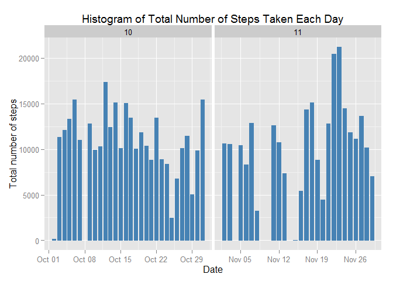
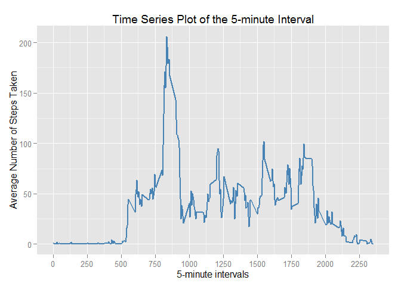
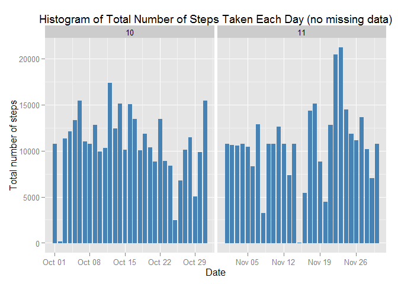

# Reproducible Research: Peer Assessment 1


## Introduction


The current time is Sun, Aug, 16, 6:05:24 PM, 2015.

This document presents the results of **Peer Assessments 1** of course [Reproducible Research] [4] on [Coursera] [5]. It is now possible to collect a large amount of data about personal movement using activity monitoring devices such as a [Fitbit] [1], [Nike Fuelband] [2], or [Jawbone Up] [3]. These type of devices are part of the "quantified self" movement - a group of enthusiasts who take measurements about themselves regularly to improve their health, to find patterns in their behavior, or because they are tech geeks. But these data remain under-utilized both because the raw data are hard to obtain and there is a lack of statistical methods and software for processing and interpreting the data.

This assignment makes use of data from a personal activity monitoring device. This device collects data at 5 minute intervals through out the day. The data consists of two months of data from an anonymous individual collected during the months of October and November, 2012 and include the number of steps taken in 5 minute intervals each day.

This document presents the results in a report using **a single R Markdown document** that can be processed by **knitr** and be transformed into an HTML file.

Through this report you can see that activities on weekdays mostly follow a work related routine, where we find some more intensity activity in little a free time that the employ can made some sport.

## Data

The data for this assignment can be downloaded from the course web site:

Dataset: [Activity monitoring data] [6] [52K]
The variables included in this dataset are:

- **steps**: Number of steps taking in a 5-minute interval (missing values are coded as NA)

- **date**: The date on which the measurement was taken in YYYY-MM-DD format

- **interval**: Identifier for the 5-minute interval in which measurement was taken

The dataset is stored in a comma-separated-value (CSV) file and there are a total of 17,568 observations in this dataset.


[1]: http://www.fitbit.com/pe "Fitbit"
[2]: http://www.nike.com/us/en_us/c/nikeplus-fuel "Nike Fuelband"
[3]: https://jawbone.com/up "Jawbone Up"
[4]: https://www.coursera.org/course/repdata "Reproducible Research"
[5]: https://www.coursera.org/ "Coursera"
[6]: https://d396qusza40orc.cloudfront.net/repdata%2Fdata%2Factivity.zip "Activity monitoring data"

## Prepare the R environment

Throughout this report when writing code chunks in the R Markdown document, **always use echo = TRUE** so that someone else will be able to read the code.

First, you should set echo equal a **TRUE**  as global options for this document.


```r
library(knitr)
opts_chunk$set(echo = TRUE, results = "hold")
```

### Load required libraries

It's necessary several packages, you will be using - knitr, data.table, ggplot2 and dplyr packages


```r
library(knitr)
library(data.table)
library(ggplot2) # ggplot2 for plotting figures
library(lattice)
library(dplyr) ## dplyr is used for structuring the data for analysis
```

```
## 
## Attaching package: 'dplyr'
## 
## The following objects are masked from 'package:data.table':
## 
##     between, last
## 
## The following objects are masked from 'package:stats':
## 
##     filter, lag
## 
## The following objects are masked from 'package:base':
## 
##     intersect, setdiff, setequal, union
```

### Set the working directory

Set the working directory on your local computer


```r
setwd("D:/Documentos/Training/Coursera/ReproducibleResearch/PeerAssessment1/RepData_PeerAssessment1")
```

## Loading and preprocessing the data

### Load the required data

Read in the data from the local zipped file to the object activity, and convert the activity object to a tbl class.


```r
unzip (zipfile = "./activity.zip")
activity <- read.csv("./activity.csv", stringsAsFactors = FALSE) ## read in the data
```

### Tidy the data or preprocess the data

You should transform the data into a **tbl_df** format wich is suitable for your analysis. Next, you should convert the **date** field to Date class and **interval** field to Factor class.


```r
activity <- tbl_df(activity) ## structure the data as a tbl class
activity$date <- as.Date(activity$date, format = "%Y-%m-%d")
activity$interval <- as.factor(activity$interval)
activity$month <- as.numeric(format(activity$date, "%m"))
activity_na.rm <- na.omit(activity)
# rownames(noNA) <- 1:nrow(noNA)
head(activity_na.rm)
dim(activity_na.rm)
```

```
## Source: local data frame [6 x 4]
## 
##   steps       date interval month
## 1     0 2012-10-02        0    10
## 2     0 2012-10-02        5    10
## 3     0 2012-10-02       10    10
## 4     0 2012-10-02       15    10
## 5     0 2012-10-02       20    10
## 6     0 2012-10-02       25    10
## [1] 15264     4
```

Now, you can check the data structure using str() method:


```r
str(activity)
```

```
## Classes 'tbl_df', 'tbl' and 'data.frame':	17568 obs. of  4 variables:
##  $ steps   : int  NA NA NA NA NA NA NA NA NA NA ...
##  $ date    : Date, format: "2012-10-01" "2012-10-01" ...
##  $ interval: Factor w/ 288 levels "0","5","10","15",..: 1 2 3 4 5 6 7 8 9 10 ...
##  $ month   : num  10 10 10 10 10 10 10 10 10 10 ...
```

After, you can check the data summary using summary() method:


```r
summary(activity)
```

```
##      steps             date               interval         month      
##  Min.   :  0.00   Min.   :2012-10-01   0      :   61   Min.   :10.00  
##  1st Qu.:  0.00   1st Qu.:2012-10-16   5      :   61   1st Qu.:10.00  
##  Median :  0.00   Median :2012-10-31   10     :   61   Median :10.00  
##  Mean   : 37.38   Mean   :2012-10-31   15     :   61   Mean   :10.49  
##  3rd Qu.: 12.00   3rd Qu.:2012-11-15   20     :   61   3rd Qu.:11.00  
##  Max.   :806.00   Max.   :2012-11-30   25     :   61   Max.   :11.00  
##  NA's   :2304                          (Other):17202
```

## What is mean total number of steps taken per day?

For this part of the assignment, you can ignore the missing values in the dataset. 

1. Calculate the total number of steps taken per day


```r
activity_days <- activity %>% group_by(date) %>% summarise(total_steps = sum(steps)) %>% print
```

```
## Source: local data frame [61 x 2]
## 
##          date total_steps
## 1  2012-10-01          NA
## 2  2012-10-02         126
## 3  2012-10-03       11352
## 4  2012-10-04       12116
## 5  2012-10-05       13294
## 6  2012-10-06       15420
## 7  2012-10-07       11015
## 8  2012-10-08          NA
## 9  2012-10-09       12811
## 10 2012-10-10        9900
## ..        ...         ...
```

2. Make a histogram of the total number of steps taken each day


```r
ggplot(activity_na.rm, aes(date, steps)) + geom_bar(stat = "identity", colour = "steelblue", fill = "steelblue", width = 0.7) + facet_grid(. ~ month, scales = "free") + labs(title = "Histogram of Total Number of Steps Taken Each Day", x = "Date", y = "Total number of steps")
```

 

3. Calculate and report the mean and median of the total number of steps taken per day


```r
mean <- mean(activity_days$total_steps, na.rm = TRUE)
med <- median(activity_days$total_steps, na.rm = TRUE)
```

- The mean of the total number of steps taken per day is 1.0766189\times 10^{4}.

- The median of the total number of steps taken per day is 10765.


## What is the average daily activity pattern?

1. Make a time series plot (i.e. type = "l") of the 5-minute interval (x-axis) and the average number of steps taken, averaged across all days (y-axis)

- Calculate the average number of steps for each interval using the group_by and summarise functions


```r
activity_interval <- activity %>% group_by(interval) %>% summarise(mean_steps = mean(steps, na.rm =TRUE)) %>% print
```

```
## Source: local data frame [288 x 2]
## 
##    interval mean_steps
## 1         0  1.7169811
## 2         5  0.3396226
## 3        10  0.1320755
## 4        15  0.1509434
## 5        20  0.0754717
## 6        25  2.0943396
## 7        30  0.5283019
## 8        35  0.8679245
## 9        40  0.0000000
## 10       45  1.4716981
## ..      ...        ...
```


```r
activity_interval$interval <- as.numeric(as.character(activity_interval$interval))
ggplot(activity_interval, aes(interval, mean_steps)) + geom_line(color = "steelblue", size = 0.8) + scale_x_continuous(breaks=seq(0,2500,250)) + labs(title = "Time Series Plot of the 5-minute Interval", x = "5-minute intervals", y = "Average Number of Steps Taken")
```

 

2. Which 5-minute interval, on average across all the days in the dataset, contains the maximum number of steps?


```r
max_steps_interval <- which.max(activity_interval$mean_steps)
print(activity_interval[max_steps_interval,])
```

```
## Source: local data frame [1 x 2]
## 
##   interval mean_steps
## 1      835   206.1698
```


## Imputing missing values

Note that there are a number of days/intervals where there are missing values (coded as NA). The presence of missing days may introduce bias into some calculations or summaries of the data.

1. Calculate and report the total number of missing values in the dataset (i.e. the total number of rows with NAs)


```r
missing_vals <- sum(is.na(activity$steps))
missing_vals
```

```
## [1] 2304
```

The total number of **missing values** are 2304.

2. Devise a strategy for filling in all of the missing values in the dataset. The strategy does not need to be sophisticated. For example, you could use the mean/median for that day, or the mean for that 5-minute interval, etc.

- To populate missing values, I choose to replace them with the mean value at the same interval across days. In most of the cases the median is a better centrality measure than mean, but in this case the total median is not much far away from total mean, and probably we can make the mean and median meets.

3. Create a new dataset that is equal to the original dataset but with the missing data filled in.


```r
activity_new <- activity 
for (i in 1:nrow(activity_new)) {
  if (is.na(activity_new$steps[i])) {
    activity_new$steps[i] <- activity_interval[which(activity_new$interval[i] == activity_interval$interval), ]$mean_steps
  }
}

head(activity_new)
sum(is.na(activity_new))
```

```
## Source: local data frame [6 x 4]
## 
##       steps       date interval month
## 1 1.7169811 2012-10-01        0    10
## 2 0.3396226 2012-10-01        5    10
## 3 0.1320755 2012-10-01       10    10
## 4 0.1509434 2012-10-01       15    10
## 5 0.0754717 2012-10-01       20    10
## 6 2.0943396 2012-10-01       25    10
## [1] 0
```

4. Make a histogram of the total number of steps taken each day and Calculate and report the mean and median total number of steps taken per day. 


```r
ggplot(activity_new, aes(date, steps)) + geom_bar(stat = "identity", colour = "steelblue", fill = "steelblue", width = 0.7) + facet_grid(. ~ month, scales = "free") + labs(title = "Histogram of Total Number of Steps Taken Each Day (no missing data)", x = "Date", y = "Total number of steps")
```

 

- **Do these values differ from the estimates from the first part of the assignment?** 

Mean total number of steps taken per day:


```r
activity_days_new <- activity_new %>% group_by(date) %>% summarise(total_steps = sum(steps))
newMean <- mean(activity_days_new$total_steps)
newMean
```

```
## [1] 10766.19
```

Median total number of steps taken per day:


```r
newMedian <- median(activity_days_new$total_steps)
newMedian
```

```
## [1] 10766.19
```

Compare them with the two before imputing missing data:


```r
oldMean <- mean(activity_days$total_steps, na.rm = TRUE)
oldMedian <- median(activity_days$total_steps, na.rm = TRUE)

## Before filling the data
oldMean
oldMedian

## ## After filling the data
newMean
newMedian
```

```
## [1] 10766.19
## [1] 10765
## [1] 10766.19
## [1] 10766.19
```

Before filling the data

- Mean : 1.0766189\times 10^{4}
- Median: 10765

After filling the data

- Mean : 1.0766189\times 10^{4}
- Median: 1.0766189\times 10^{4}

So, after imputing the missing data, the new mean of total steps taken per day is the same as that of the old mean; the new median of total steps taken per day is greater than that of the old median.

- **What is the impact of imputing missing data on the estimates of the total daily number of steps?**

As you can see, comparing with the calculations done in the first section of this document, we observe that while the mean value remains unchanged, the median value has shifted and virtual matches to the mean.

Since our data has shown a t-student distribution (see both histograms), it seems that the impact of imputing missing values has increase our peak, but it's not affect negatively our predictions.


## Are there differences in activity patterns between weekdays and weekends?

For this part the weekdays() function may be of some help here. Use the dataset with the filled-in missing values for this part.

1. Create a new factor variable in the dataset with two levels - "weekday" and "weekend" indicating whether a given date is a weekday or weekend day.


```r
head(activity_new)
activity_new$weekdays <- factor(format(activity_new$date, "%A"))
levels(activity_new$weekdays)
levels(activity_new$weekdays) <- list(weekday = c("Monday", "Tuesday", "Wednesday", "Thursday", "Friday"), weekend = c("Saturday", "Sunday"))
levels(activity_new$weekdays)
table(activity_new$weekdays)
```

```
## Source: local data frame [6 x 4]
## 
##       steps       date interval month
## 1 1.7169811 2012-10-01        0    10
## 2 0.3396226 2012-10-01        5    10
## 3 0.1320755 2012-10-01       10    10
## 4 0.1509434 2012-10-01       15    10
## 5 0.0754717 2012-10-01       20    10
## 6 2.0943396 2012-10-01       25    10
## [1] "Friday"    "Monday"    "Saturday"  "Sunday"    "Thursday"  "Tuesday"  
## [7] "Wednesday"
## [1] "weekday" "weekend"
## 
## weekday weekend 
##   12960    4608
```

2. Make a panel plot containing a time series plot (i.e. type = "l") of the 5-minute interval (x-axis) and the average number of steps taken, averaged across all weekday days or weekend days (y-axis). See the README file in the GitHub repository to see an example of what this plot should look like using simulated data.


```r
avgSteps <- aggregate(activity_new$steps, list(interval = as.numeric(as.character(activity_new$interval)), weekdays = activity_new$weekdays), FUN = "mean")
names(avgSteps)[3] <- "meanOfSteps"
xyplot(avgSteps$meanOfSteps ~ avgSteps$interval | avgSteps$weekdays, layout = c(1, 2), type = "l", xlab = "Interval", ylab = "Number of steps")
```

 

- There exists clear differences in activity between weekends and weekdays, which is understandable as most people are more active in the weekends than they are during the week.
